# 缘由
前两个星期，无意中在小米有品的商店中看到一款[电子墨水屏的日历](https://www.xiaomiyoupin.com/detail?gid=120143&spmref=YouPinPC.$SearchFilter$1.search_list.1.66578030)，如下图。觉得挺有意思。刚好新馆疫情前期时，在家闲得慌也用微雪的墨水屏做过一个[展示COVID数据的可穿戴设备外挂](https://github.com/breakstring/covid19_e-paper)。
简单评估了下觉得这玩意儿也不难，那就自己做一个毒鸡汤电子墨水屏日历吧。

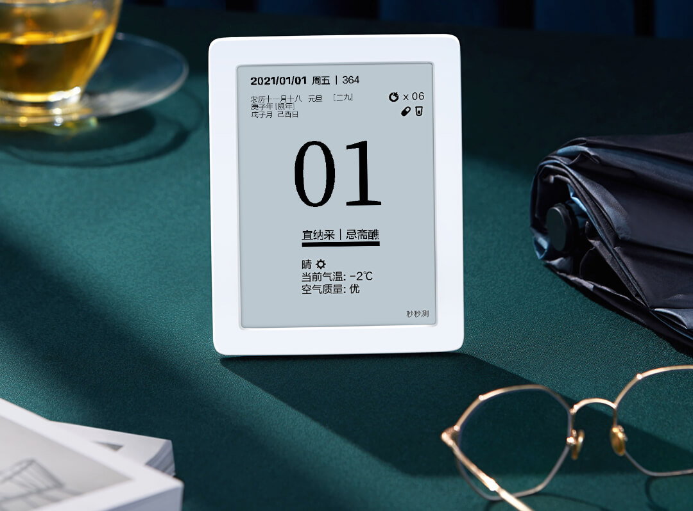

## 方案选型
### 硬件
- **屏幕**：在这样的电子产品中，屏幕可能会是硬件成本最大的一块了。从某些评测视频中看到，秒秒测的这款电子日历为了降低硬件成本同样没有采用并口的墨水屏方案，只能全刷屏幕且刷新率较低，尺寸为5.83寸。恰好微雪也有一款[同尺寸的屏幕如下图](https://www.waveshare.net/shop/5.83inch-e-Paper.htm)分辨率为648*480，我也就毫不犹豫的采用了这款。此屏幕零售价格为231元，如果您希望未来通过树莓派或者其他Arduino设备来驱动他，可以选择带有适配板的套装价格为283.5元。当然，现在随着电子墨水屏技术的发展其实也有了彩色的，例如微雪这里也有可额外显示红色或者黄色的版本。不过成本自然就上去了，同时如果您想要复用我的代码，可能也或多或少需要做些少量改动。

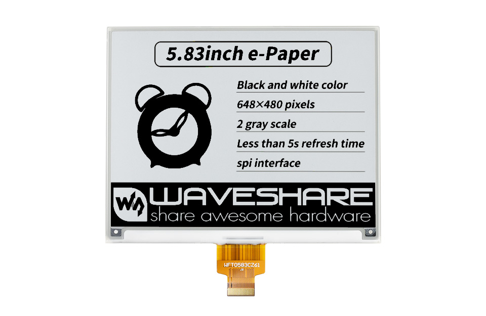
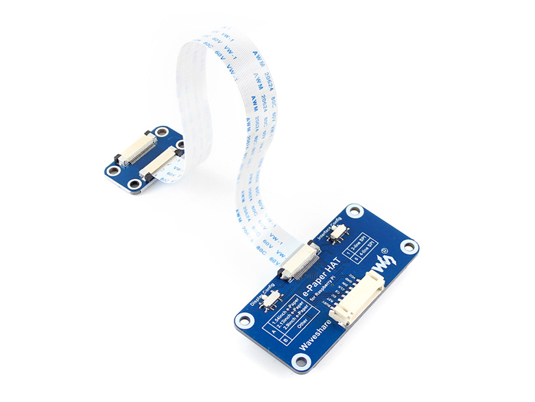

- **计算单元**：目前使用乐鑫的ESP32芯片可能是个最佳选择，自带2.4G无线网络和蓝牙，具有充足的引脚。动手能力强的可以自己买基于ESP32的模组然后整合到自己的板子里，当然也可以采用市面上各种各样基于ESP32的开发板（当然，前面这两种方式都需要买屏幕时顺便买上适配板，好将屏幕的软排线转换为SPI接口）。作为我这种硬件手残党，加上为了快速出东西，自然还是选用微雪的自带了软排线接口的基于ESP32的[墨水屏开发板](https://www.waveshare.net/shop/e-Paper-ESP32-Driver-Board.htm)了，价格78.75元。

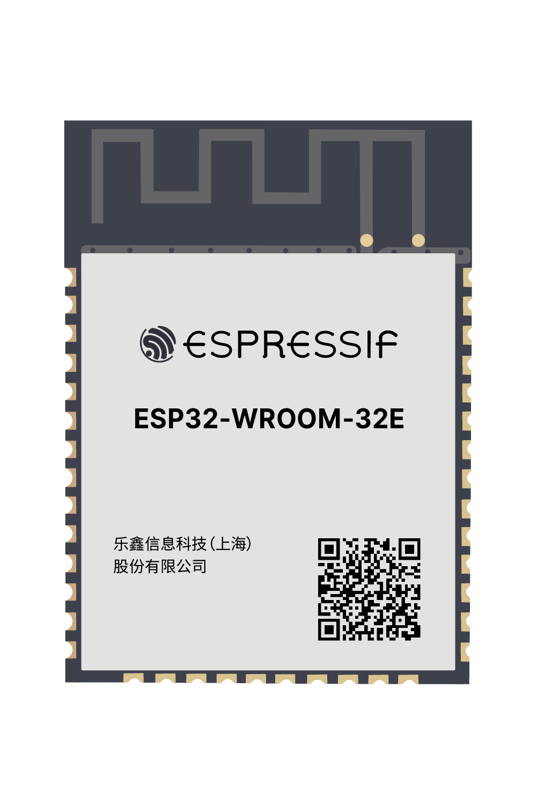
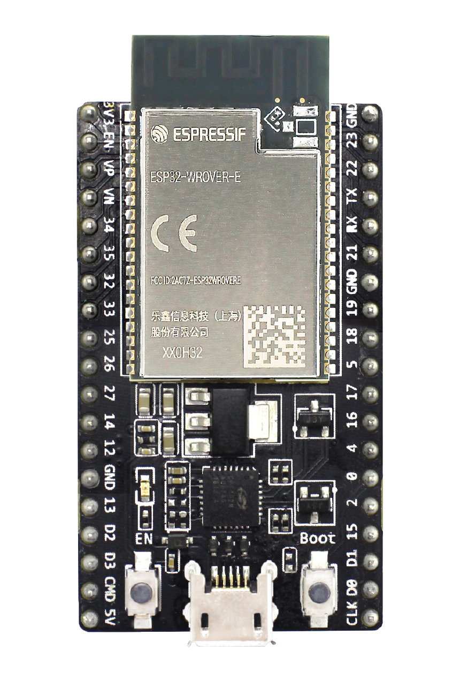
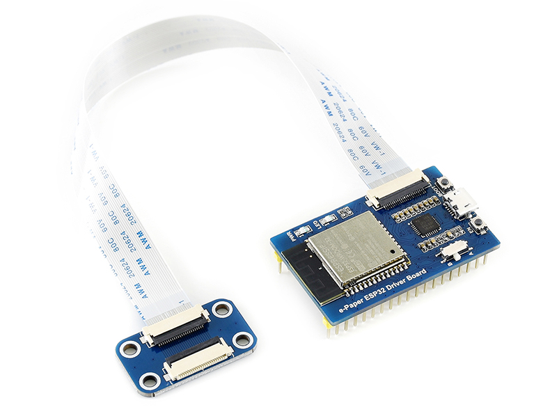

- **电源**：在开发过程中，可以通过电脑上的USB接口用micro USB线直接通过开发板来进行供电和调试工作。如果您想要在实际使用中摆脱开电源线的话，我建议您从伟大的某宝上找一块自带micro USB充放接口的锂电池。更具电池的容量不同价格可能不一，不过一般也都是在50元以下，可选择的太多这里我就不放链接了。

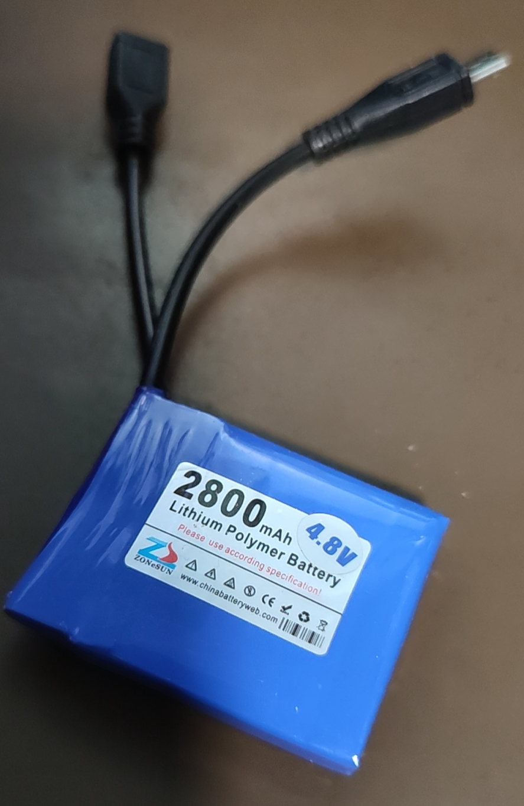

- 最后。。。别忘了。。。框架： 根据您的实际情况，找个合适的镜框/盒子什么的，当然您愿意的话裸板挂在墙上也不是不可以。


### 软件
- **框架**：ESP32上的应用程序可以采用多种软件框架和语言来开发，例如Espressif自己的EDF-IDF框架，或者大家熟悉的Arduino。对我来说，还是用Arduino比较方便点，毕竟里面有许多大量的现成的第三方库可以使用。
- **开发工具**：虽然使用了Arduino框架，但是我还是放弃了Arduino自有的IDE，那玩意儿太难用了，谁用谁知道。都2020年（误，写文档的今天已经是2021年了）我自然是推荐使用[Visual Studio Code](https://code.visualstudio.com/)了，和Git的整合，各种语法高亮快捷跳转。。。相比之下Arduino IDE简直是小盆友的玩具。使用VSCode你来开发Arduino应用的话也还有两个选择，使用[微软自己的Arduino插件](https://github.com/Microsoft/vscode-arduino)，或者使用[PlatformIO](https://platformio.org/)。它也是VSCode的插件，但是内置了各种嵌入式硬件平台和框架和库的整合。用它来做Arduino开发简直要爽到飞起。不过PlatformIO和微软的Arduino插件有冲突只能二选一（我个人还是推荐PlatformIO）。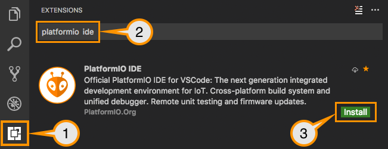
- **相关类库**: 在本软件开发中，主要用到了如下第三方库
    - [Adafruit GFX]((https://github.com/adafruit/Adafruit-GFX-Library)): 由著名的电子硬件社区Adafruit提供的一套图形图像引擎。做各种需要显示输出的Arduino应用一般都少不了它了。
    - [GxEPD2](https://github.com/ZinggJM/GxEPD2):基于[Adafruit_GFX](https://github.com/adafruit/Adafruit-GFX-Library)库来驱动各种电子墨水屏。
    - [U8g2 for Adafruit GFX](https://github.com/olikraus/U8g2_for_Adafruit_GFX)：一套基于[U8g2](https://github.com/olikraus/U8g2)字体引擎来通过Adafruit GFX来显示文字的第三方库。
    - 对于中文字库的生成我使用了前几天撸的一个[懒人工具](https://github.com/breakstring/u8g2_fontmaker)来配合U8g2 for Adafruit GFX.
    - [ArduinoJSON](https://arduinojson.org/):要处理JSON字符串现在少不了它了。
- **相关服务**：
    - [IP地址查询](https://www.myip.la/)：用来通过当前设备的IP地址查询得知当前位置。具体可见 [src/MyIP.h](src/MyIP.h) 和 [src/MyIP.cpp](src/MyIP.cpp)
    - 字体：项目中的字体使用了[造字工房](https://www.makefont.com/)的部分非商用字体来生成。如您要使用，请确保在其[授权范围](https://www.makefont.com/authorization.html)内使用。
    - 天气服务：这里用了[和风天气开发平台](https://dev.qweather.com/)的服务。所以需要您前往注册账号并获取到自己的一个应用程序Key来替换[src/config.h](src/config.h)中的占位符
```cpp
const String QWEATHER_API_KEY = "********************";
```
## 成品
只需要简单的替换源代码中你的和风天气API的Key，然后把程序烧录到开发板里，用热熔胶和其他工具把它固定到镜框里，连接上电源。一个**毒鸡汤电子墨水屏日历**就完工了。
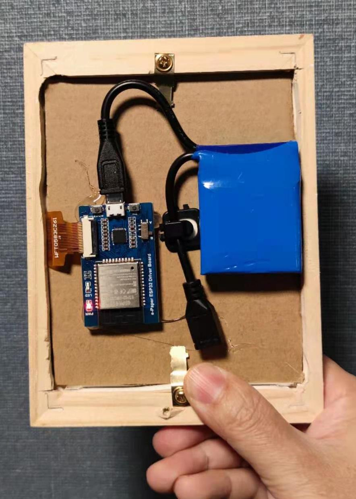
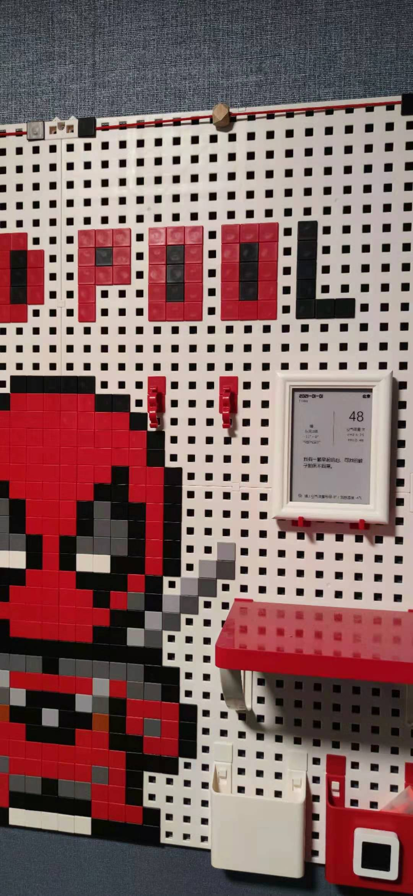
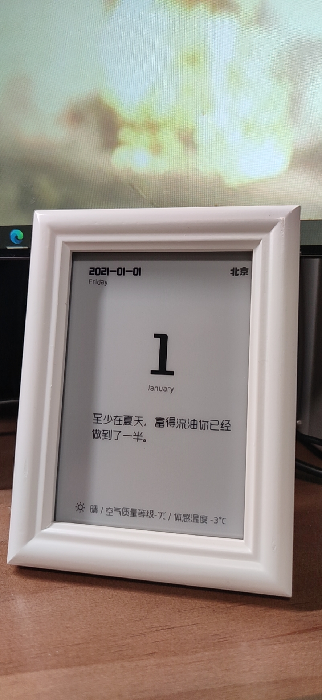

## 待优化
- 增加更多内容。。。数据都有就看怎么画好看了。
- u8g2Fonts引擎和GxEPD2原生绘图之间的冲突问题，目前只能先写完文字刷新后再重新画图然后再刷新。存在二次刷新问题。
